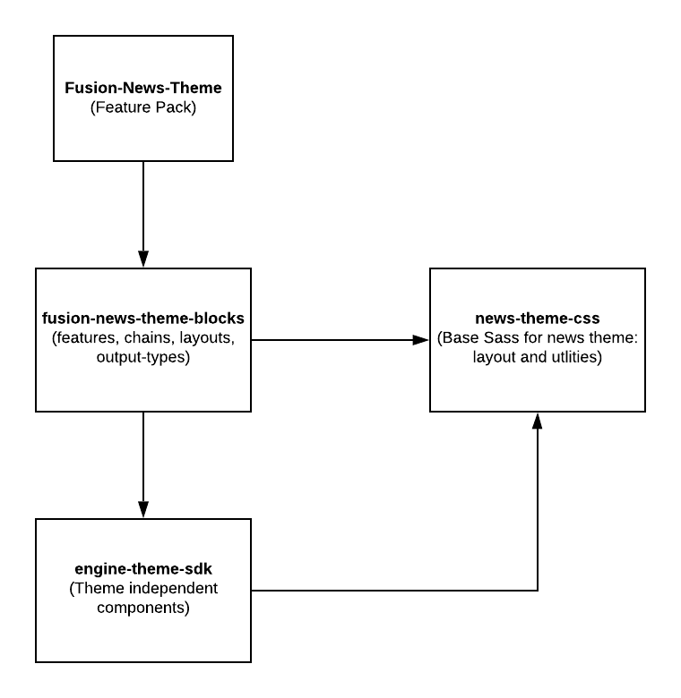
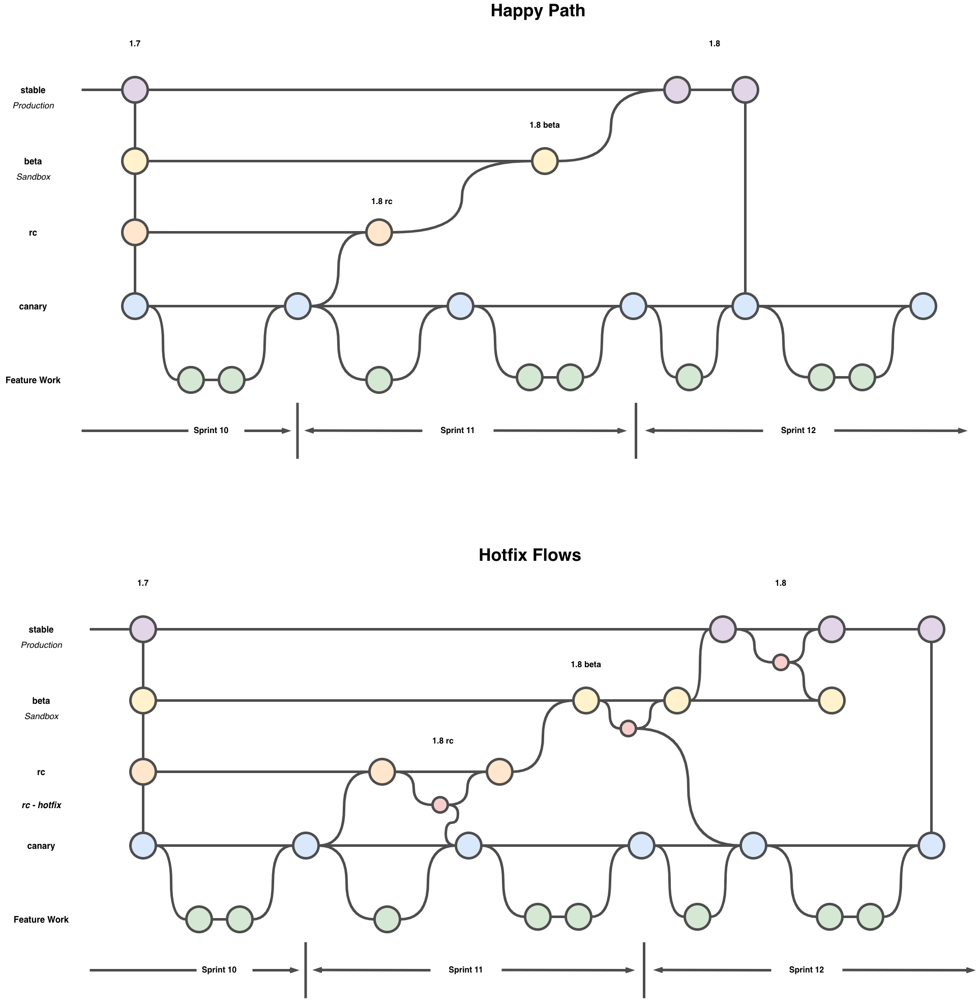

# News Theme Developers Guide

## Setup

All of the themes-related packages reside in the GitHub Package Registry. This means that you are now able to manage the packages directly in GitHub (for example, this repo's packages reside [here](https://github.com/WPMedia/fusion-news-theme-blocks/packages)), as well as incorporate GitHub Actions. You also need to make sure that you are setup with enabling SSO if you're pushing to the repo. [Please follow](https://help.github.com/en/github/authenticating-to-github/authorizing-a-personal-access-token-for-use-with-saml-single-sign-on) GitHub docs. If you don't, you'll get errors that the blocks can't be installed when trying to run `npx fusion start` in your local feature blocks repo. See [documentation](https://github.com/WPMedia/arc-themes-feature-pack#how-to-do-local-themes-development) for a step-by-step setup.

To set up this repo for local development and deployment, you'll have to set up your .npmrc like so:

```
@wpmedia:registry=https://npm.pkg.github.com/
//npm.pkg.github.com/:_authToken=<your personal access token>
```

Note that for GitHub, you will have to provide your own personal access token for it to be able to properly find and install your GitHub packages. Please follow the instructions on these documentation to generate your GitHub token:

- [Configuring your local authentication with npm](https://help.github.com/en/packages/using-github-packages-with-your-projects-ecosystem/configuring-npm-for-use-with-github-packages)
- [Creating Auth Tokens (HTTPS)](https://help.github.com/en/github/authenticating-to-github/creating-a-personal-access-token-for-the-command-line)
- [Enable SSO for Auth Tokens](https://help.github.com/en/github/authenticating-to-github/authorizing-a-personal-access-token-for-use-with-saml-single-sign-on)
- [Authorizing SSH Keys](https://help.github.com/en/github/authenticating-to-github/authorizing-an-ssh-key-for-use-with-saml-single-sign-on)

## Introduction

Themes are a new way for clients to rapidly build their website through the selection of pre-built "blocks" which are a collection of features, chains, layouts and output types. Instead of the traditional client onboarding process where all components for the site are custom made, a themes client onboarding process is exponentially reduced as the need for custom components are significantly reduced or even eliminated.

This document will go over the overall architecture of themes, a more detailed look at the various code repositories, how to develop for them and along the way discover how everything comes together.

## Theme Architecture

The image below shows the four repositories that go into building out the News theme. We will describe each repository and the role it plays.



### news-theme-css

The news-theme-css repo is located at: <https://github.com/WPMedia/news-theme-css>. This Sass based repository provides the foundation CSS for the news theme and also holds some of the styling for components in the other news theme repositories. The main responsibilities, however, are:

1.  A CSS grid layout framework (with flexbox fallback for older browsers)
2.  CSS reset
3.  Typography
4.  Breakpoints and spacing
5.  Utility Sass functions (i.e. convert px to rems, etc.)

The grid layout part of the framework is a simple row/column grid. It uses CSS Grid, but defaults to using flexbox when grid is not supported in the browser. While the grid framework can be nested, its recommended to use the grid framework for overall page layouts and then use flexbox (or other CSS) for the layouts inside columns. If, however, you feel a nested grid is warranted, you'll probably want to use `.container-fluid` over `.container` for your nested grid wrapper element as it has its margins set to auto.

The majority of the framework is documented using KSS (<https://github.com/kss-node/kss-node>). This allows for a style guide to be generated and to show markup examples in the compiled CSS (which may be hard to infer from the Sass alone, especially for the grid column classes). This is stored in the /styleguide folder of the project. Opening up /news-theme-css/styleguide/index.html in a browser will show you the main page of the documentation.

While the style guide will provide a good overview, it's advisable to review the Sass files as well to have a proper understanding of its usage. For example, if you look in scss/\_variables.scss you will see variables such as `$primary-font-family` and `$secondary-font-family`. These variables use the Sass notation `!default` at the end so that they can be over-ridden in the themes file, `blocks.json`, located in the arc-themes-feature-pack repository. (We will talk about `blocks.json` more in the arc-themes-feature-pack section.). Also, if you look in scss/\_breakpoints.scss you will see Sass maps for breakpoints and spacing. These maps are leveraged with the Sass function, `map-get`, in component Sass code to set spacing and media queries.

news-theme-css is provided to the other parts of the system as an NPM package. For more information on the build and publishing process for this repository, please see the readme.md for the project: <https://github.com/WPMedia/news-theme-css/blob/stable/readme.md>

### engine-theme-sdk

The engine-theme-sdk is located at: <https://github.com/WPMedia/engine-theme-sdk>. The purpose of this repository is to store basic React components and utilities that are not tied to one specific theme. So, for example, there is a lightbox and image component. We also store React based svg icons in here as well. Unlike the other repos in the system, this repo uses TypeScript, so its important to build the repo and commit the generated source before committing changes and publishing.

For contributing to that repo, please see its contributing guidelines.

### fusion-news-theme-blocks

The fusion-news-theme-blocks repo is located at: <https://github.com/WPMedia/fusion-news-theme-blocks>. In a typical client setup, you have a feature pack repository and inside you have a components directory where you store your code for feature, chains, etc. In our theme's environment, the majority of these components will be stored in this repo instead. We refer to these external components as "blocks." The components directory in the feature pack will be reserved for custom components that the client might build. This separation from the feature pack will allow the customer to pick and choose the components that they want added in their site. Also, because fusion-news-them-blocks is a multi-repo (using Lerna), any unused components will not be part of the client bundle.

As indicated from the diagram above, fusion-news-theme-blocks is dependent on the engine-theme-sdk and news-theme-css packages. As you will see in the arc-themes-feature-pack section, we have a way to set theming properties (color, font-family, etc). To set these properties, we are using styled components to inject these values into the component.

The development process is similar engine-theme-sdk, except when it comes time to publish, you need to follow the Lerna publish procedure. For more information, see the repo's read me: <https://github.com/WPMedia/fusion-news-theme-blocks/blob/stable/README.md>

Note: When creating a bundle, you will need a `.npmrc` file in your feature pack that has credentials accessed to the GitHub Package Registry. Please see [guide](https://github.com/WPMedia/arc-themes-feature-pack#how-to-do-local-themes-development) for more info on what you need in the `.npmrc` in the feature pack (arc-themes-feature-pack) and also in the blocks repo (fusion-news-theme-blocks) for local development. There's also more info on `npx fusion zip` for creating a bundle on the fusion-cli repo [readme](https://github.com/WPMedia/fusion-cli#commands).

Local development work on  fusion-news-theme-blocks can be set up so that the changes you make on your local fusion-news-theme-blocks  can be manifested within another local client code base, or arc-themes-feature-pack.

As of 10/13/2020, In fusion-news-theme-blocks, Blocks/header-nav-chain-block use-debounce which needs to be installed manually. Navigate to this block, copy .npmrc file to this dir, do npm install, the (re)start fusion. You can also look into setting up a [global npmrc configuration](https://docs.npmjs.com/cli-commands/config.html).
```sh
cd blocks/header-nav-chain-block
check .npmrc file here exists
npm install
```
Then restart fusion from within client dir. NOTE: Running with `-l` will link all blocks. If you want to only link some blocks, please use `npx fusion start -f -l @wpmedia/card-list-block,@wpmedia/top-table-list-block`, for example, to link card list block and the top table list block. You can see their package names' in the block's package.json.

(arc-themes-feature-pack):
```sh
npx fusion start -l
```

To check if blocks are being properly linked, run:
```sh
 cat .fusion/docker-compose.yml
 ```
  If blocks linking was successful, you'll see the listing for volumes with all the block names linked.

  NOTE:  'npm fusion' will use the  globally available fusion, but using 'npx fusion' will use the local fusion available from within the folder

### Creating New Block Checklist

- [ ] Make sure it is added to the `names` field of `.github/workflows/delete-unused-canary-packages.yml`. Please add the block name (without org name WPMedia, similar to others) to the last step's name field as there can only be 20 packages per step.
- [ ] The block has a valid file path. Please see [documentation](https://github.com/WPMedia/fusion/blob/2.7/documentation/recipes/creating-feature-component.md) for best practices around file paths and development
- [ ] The block is locally linked to ensure tests and linking run as expected. See `package.json`'s `dependencies` field for examples
- [ ] Your new block has a readme that describes its purpose. The `blocks/results-list-block/README.md` is pretty good.
- [ ] Your devDependencies in the block's package.json are installed in the `arc-themes-feature-pack` or elsewhere. `devDependencies` are not installed by the [Fusion block installer](https://github.com/WPMedia/fusion/blob/2.7/engine/scripts/block-installer.js#L57)
- [ ] You have a valid `jest.config.js` in your package to ensure that any tests (and they should exist) are run

```js
// cool-new-block/jest.config.js
const base = require('../../jest/jest.config.base');

module.exports = {
  ...base,
};
```

### Internationalization

Phrase translations may be added via an intl.json file for each block to contain the phrases that block needs. For example  this is the intl.json file for results list block:
```sh
{
   "results-list-block.see-more-button":{
      "en":"See More",
      "sv":"Fler artiklar",
      "no":"Se mer"
   }
}
```
Common phrases needed across multiple blocks are declared in global-phrases-block.  In order for the intl.json files to be included in a build, it must be included in the lists for a block in that blocks package.json file:
```sh
  "files": [
    "features",
    "intl.json"
  ],
```

---

## Development Process

### Release scripts (ran in github actions)

#### `npm run release:canary`

- Only publish packages to canary tag
- Publish packages based on only changes
- Iterates the prerelease version using `--canary` arg that allows prerelease (not necessarily canary)


#### `npm run release:beta`

- Only publish packages to beta
- Publish packages based on only changes
- Iterates the prerelease version using `--canary` arg that allows prerelease (not necessarily canary)


#### `npm run release:rc`

- Only publish packages to rc
- Publish packages based on only changes
- Iterates the prerelease version using `--canary` arg that allows prerelease (not necessarily canary)

### `npm run release:stable`

- Only publish packages that have changed to stable tag
- Note: We are versioning minor versions. In the future, we can look into breaking (major) changes for this. For example:

 - @WPMedia/headline: 1.2.0-canary.0 => 1.3.0

1. Pull the latest `canary` branch:

```sh
git checkout canary
git fetch -a
```

2. Branch off the `canary` branch:

```sh
git checkout -b TMEDIA-[jira ticket num]-[brief description of feature]
```

3. Do the work (heh). Commit as you go, which will run the linter and tests.
4. Make pull request using Github against the `canary` branch. Get approval for your PR on your feature branch.
5. Merge the PR into the `canary` branch. At this point a release with the dist-tag of `canary` will be built automatically. This means that if you want to verify your changes in a deployed environment, you need to make sure you're using the `canary` dist-tag in whatever environment that is by setting the `BLOCK_DIST_TAG` environment variable in your environment file(s).

### Deployment for QA

In the development process this takes care of doing the work and getting your changes into the `canary` tag. In order to see your changes on a live environment for QA you will need to use the Fusion deployer to either deploy a new bundle or duplicate an existing one - http://redirector.arcpublishing.com/deployments/fusion/

* If you have a running bundle on your environment you can "Duplicate" the bundle and wait for it to build, then "Promote" it to be live - options are under the three vertical dots menu on the deployer page
* If you do not have a bundle that has the `BLOCK_DIST_TAG` set to `canary` you will need to create a bundle, upload and then "Deploy"

### Creating a feature pack

If you need to create a feature pack to set either `BLOCK_DIST_TAG` to a specific tag, or update blocks you wish to have deployed or change site settings you need to:

1. Have the arc-themes-feature-pack repo `master` branch checked out - https://github.com/WPMedia/arc-themes-feature-pack
2. Update the relevant files
  * For `BLOCK_DIST_TAG` this is set in `/environment/index.json`
  * Changing blocks - update the `blocks` array in `/blocks.json`
  * Changing default site settings - update the `values.default.siteProperties` in `/blocks.json`
  * Changing a specific sites settings - update the `values.sites.{SITE-NAME}.siteProperties` in `/blocks.json`
3. Create a feature pack zip
  * In terminal in the root of the arc-themes-feature-pack repo run `npx fusion zip`
  * A new zip file will be added to `/dist/` folder named in a date format eg `2021-03-26-13-56-25.zip`
4. Upload zip file to the relevant environment using Fusion deployer, using "upload bundle" - http://redirector.arcpublishing.com/deployments/fusion/
5. Once uploded, using three dots menu on your uploaded item choose "Deploy"
6. You'll see your bundle listing in the "Running" list, once it's finished deploying you are then able to promote it to make it a live bundle
  * If you do not promote it you can see access the bundle using the `d={VERSION}` query param - https://{URL-TO-YOUR-SITE}/?d=725


### How To Publish

Merge into `canary` branch to publish to canary tag. Please reach out to arc block maintainers to talk about publishing into `beta`, `stable`, `rc`, or other desired tags. The tags and publish GitHub Actions can be tracked by looking at the [Actions tab on the GitHub UI](https://github.com/WPMedia/fusion-news-theme-blocks/actions) and within the .github folder within the repository.

WARNING: If you need help rolling back publish, please see the wiki [How A Dev Can Rollback Published Version](https://github.com/WPMedia/fusion-news-theme-blocks/wiki/How-To-%22Rollback%22-From-A-Published-Version)

---

## Creating a Release Candidate (RC)

RC Release is the contents of the canary branch once signed off - Canary -> RC

1. Ensure canary is signed off with all RC tickets merged in
2. `git checkout canary && git remote update --prune origin && git reset --hard origin/canary` - Checkout canary and reset your local to remote canary
3. `git push origin canary:rc -f`
4. Check GitHub action used to publish rc tag for success - https://github.com/WPMedia/fusion-news-theme-blocks/actions/workflows/rc-build.yml

Any environment with the `BLOCK_DIST_TAG=rc` will get the updated blocks on next deploy


## Creating a Beta Release

Beta Release is the contents of the RC branch once signed off - RC -> Beta

1. Enusre RC is ready - All PR's/hotfixes made against RC are merged in
2. `git checkout rc && git remote update --prune origin && git reset --hard origin/rc` - Checkout rc and reset your local to remote rc
3. `git push origin rc:beta -f`
4. Check GitHub action used to publish beta tag for success - https://github.com/WPMedia/fusion-news-theme-blocks/actions/workflows/beta-build.yml

Any environment with the `BLOCK_DIST_TAG=beta` will get the updated blocks on next deploy


## Creating a stable Release

Stable Release is the contents of the beta branch once signed off - beta -> stable

1. Create a Pull Request from Beta -> Stable
    * https://github.com/WPMedia/fusion-news-theme-blocks/compare/stable...beta?expand=1
    * Resolve any conflicts
2. Get pull request approved and merged
3. Get latest stable code locally - `git checkout stable && git remote update --prune origin && git reset --hard origin/stable`
4. Releasing blocks to stable is a manual step
    * Clean your local folder and install dependencies - `npx lerna clean -y && rm -rf node_modules && npm i && npx lerna clean -y`
    * Publish the blocks - `npx lerna publish --conventional-commits --conventional-graduate`
    * Make sure all blocks have been graduated or promoted.
    * Check that there is a commit in your local for the next version - created by the `npx lerna` command
    * `git push origin stable`
    * GitHub action is used to make latest and stable parity - https://github.com/WPMedia/fusion-news-theme-blocks/actions/workflows/stable-dist-tag.yml
5. Merge the last commit from `stable` to `canary` - This should only be the commit that bumps the version numbers.
    * `git checkout stable && git remote update --prune origin && git reset --hard origin/stable`
    * `git checkout canary && git remote update --prune origin && git reset --hard origin/canary`
    * `git cherry-pick {SHA OF LAST COMMIT IN STABLE}` - Commit should be the commit that bumps the version number.
    * `git push origin canary`

Any environment with the `BLOCK_DIST_TAG=stable` will get the updated blocks on next deploy

## Hotfixes

Each branch RC, beta, and stable can all have hotfixes applied to them if an issue is found in each stages regression testing.
If you need to make a change (hotfix) to any of these three branches RC, beta, stable follow the feature development flow of branch of the base branch and creating a pull request with your work.

### Hotfix a stable issue

If an issue is found in stable this is a production issue, and requires a hotfix follow these steps:

1. `git pull origin stable` - Pull remote branch to ensure you have most upto date code
2. `git checkout -b RC-Hotfix-ticket-123` - Create a hotfix branch
3. Open pull request of your branch and target it to the relevant branch - `RC-Hotfix-ticket-123` -> `stable`
4. release feature branch changes as `@hotfix` from stable.
    * `npx lerna publish --force-publish --preid hotfix --pre-dist-tag hotfix`
5. Create feature pack with @hotfix blocks to test
6. Upon successful QA, merge pull request, graduate the “hotfix” release to latest in the same publish workflow
    * `git pull origin stable`
    * `npx lerna publish --conventional-commits --conventional-graduate`
    * `git push origin stable`
7. Merge `stable` to `canary`
8. Merge hotfix branch `RC-Hotfix-ticket-123` to `beta`

Any environment with the `BLOCK_DIST_TAG=hotfix` will get the updated blocks on next deploy.

### Hotfix a Beta or RC issue

RC and Beta are used within non production environments and follow a different flow to stable. **But** require each hotfix merged into them to land back into `canary`.

RC example flow -
* `git pull origin rc` - Pull remote branch to ensure you have most upto date code
* `git checkout -b RC-Hotfix-ticket-123` - Create a branch for hotfix
* Open pull request of your branch and target it to the relevant branch - `RC-Hotfix-ticket-123` -> `rc`
* PR Approved - Merge PR via the GitHub UI then:
  * `git checkout canary && git reset --hard origin/canary`
  * `git merge RC-Hotfix-ticket-123` - Merges the hotfix onto canary
  * `git push origin canary` - Pushes the changes to canary


## Git Diagram




### Other Information

For info on hotfix background, see [hotfix section](https://www.atlassian.com/git/tutorials/comparing-workflows/gitflow-workflow) and/or [diagram](<https://wac-cdn.atlassian.com/dam/jcr:61ccc620-5249-4338-be66-94d563f2843c/05%20(2).svg?cdnVersion=1013>).

For info on rebasing, see [tutorial](https://www.atlassian.com/git/tutorials/rewriting-history/git-rebase).

For background on lerna conventional graduate and diffing, see [lerna versioning docs](https://github.com/lerna/lerna/blob/master/commands/version/README.md).

### arc-themes-feature-pack

The arc-themes-feature-pack repo is located at: <https://github.com/WPMedia/arc-themes-feature-pack>.

It is like a typical feature pack in regards that it has the same directory structure; you can add assets in the resource directory, etc. However as mentioned above, currently there are no components residing in this repo. The way this feature pack knows what components to use is through a new special file in the root of the repo called `blocks.json`. blocks.json is a special file that Fusion (Hydrate versions) knows to look for and run specific internal build commands to bring everything together. blocks.json is the glue that brings it all together.

Below describes the various properties that are in blocks.json and their purpose:

| **Property** | **Description** |
| --- | --- |
| **org** | The organization name of the NPM repo. Used internally by Fusion i.e. "@wpmedia/" |
| **useLocal** | true \| false. Used in local development (see the local dev section below). This will soon be replaced by a more conventual npm link process, so this property will eventually be removed. |
| **blocks** | This array lists all the blocks that are to be made available to the site. Any block that is in the fusion-news-theme-blocks repo, but not listed here will not be available and will also not be included in the client bundle. |
| **cssFramework** | The CSS framework package being used. For News theme, it is the news-theme-css package. |
| **cssImport** | Specifies the main Sass file entry point into the framework. This is leveraged by fusion to automatically import the framework into each of the block's source file in fusion-news-theme-blocks during build time. So, in other words, you do not have to explicitly import the css framework in your blocks source code. |
| **sassVariableOverrides** | In addition to using styled components to set theme properties, we also want the css framework to pick up on the custom settings and over-ride the appropriate Sass default properties. Fusion handles the override process internally. |
| **values** | This is where we set the custom theme values for the site. There are two main areas: default and per site. |

To see a configured blocks.json, go to <https://github.com/WPMedia/arc-themes-feature-pack/blob/master/blocks.json>

Since this is the feature pack there is no publishing process. In fact, when you build and deploy, this just like a traditional feature pack: i.e. `npx fusion zip`.

For canary we are currently using this environment: <https://corecomponents.arcpublishing.com/pf/admin/app/browse/pages.html>.

Unless you are adding new resources or custom components in this repo, you do not need to follow a PR process. Usually, you will be creating a new block in fusion-news-theme-blocks and once that has gone through the PR process and pushed to stable and published, all you'll need to do here is make sure its listed in the blocks section of `blocks.json`. If it's not listed, cause it new for example, then feel free to add it and commit immediately to stable. Then, create a build and deploy to the environment for design and general testing. If, however, you are doing something more custom then follow these procedures:

1.  First create a branch off stable for what you want to work on.
2.  Once changes are completed, then add, commit, push all changes to your branch on GitHub.
3.  Request a PR review.
4.  When the PR is approved, merge into stable.
5.  Next build using npx fusion zip and deploy to the core components environment for testing. If you want to deploy with all the blocks with a certain version, you can run `npx fusion zip <version>`. This will release with all of the blocks tagged with that version, i.e. `npx fusion zip beta` will tag all of the blocks with `@beta` tag before zipping

**Note:** When running or creating a build bundle, you will need a .npmrc file that gives you access to the private NPM repo. Reach out to a team member to get this.

## Developing Custom Blocks for use with Themes

In addition to using platform-built and maintained Arc Blocks to construct your site in PageBuilder, you can also build Custom Blocks that are custom to your website. The process is similar to developing features on Fusion – you'll build components in the components directory (https://redirector.arcpublishing.com/alc/arc-products/pagebuilder/fusion/documentation/recipes/intro.md?version=2.7). However, you can utilize the Theme CSS and SDK components within your Custom Block, so that it has the same look-and-feel as the rest of the Theme website.

- To leverage the CSS Framework, you do not need to do anything. Fusion will automatically inject it into your source files when `cssImport`, `cssFramework` and `sassVariableOverrides` (as they should be) are defined in your `blocks.json` file

- To leverage the components in `engine-theme-sdk`, simply add `@wpmedia/engine-theme-sdk` as a dependency in `packages.json` and import in your files like any other 3rd party package.

- If you plan on creating a custom default output-type, you must remove `@wpmedia/default-output-block` from the blocks list in `blocks.json` to prevent a Fusion error because of the name collision.

- When developing locally and you want to run your feature pack, please see the next section.

## Event Listening

The EventEmitter object, located in `@wpmedia/engine-theme-sdk` can be used to publish and subscribe to events. This can be useful for adding analytic tracking for a custom block. In fact, the Gallery component sends off events for when the next or previous image is viewed and when the autoplay mode is enabled.

These Gallery events are:

|  |  |
| --- | --- |
| galleryImageNext | When the next button is pressed. If the autoplay property of the event is true, the gallery is executing in autoplay mode |
| galleryImagePrevious | When the next button is pressed. |
| galleryAutoplayStart | When the autoplay button is pressed |
| galleryAutoplayStop | When the autoplay button is pressed and the autoplay mode was enabled. If the gallery reach the end of the playlist will stop and generate this event too |
| galleryExpandEnter | When the expand button is pressed |
| galleryExpandExit | When the close button on the lightbox is pressed |

If you wanted to listen to these events, the first thing is to import the EventEmitter object into the block:

```jsx
import { EventEmitter } from "@wpmedia/engine-theme-sdk";
```

Then create a callback function such as:

```jsx
const myGalleryImageNext = event => {
  console.log("Here is the event: ", event);
};
const myGalleryImagePrevious = event => {
  console.log("Here is the event: ", event);
};
```

Then use you use your callback in subscribing to the event:

```jsx
EventEmitter.subscribe("galleryImageNext", event => myGalleryImageNext(event));
EventEmitter.subscribe("galleryImagePrevious", event =>
  myGalleryImagePrevious(event)
);
```

### Secure Image Resizing Quickstart

1. In your local env, make sure you have a plaintext resizer key in the bundle repo. That plaintext resizer should be the decrypted from the hash in the environment folder `resizerKey`. Decryption cannot happen locally. This local .env file will live in the `[feature pack]/environment/index.json` -- it can be decrypted using admin with `[https://yoursite.arcpublishing.com]/deployment/fusion/secrets`.

_arc-themes-feature-pack/.env_

```
resizerKey=[no brackets, should be decrypted resizer key in the env index]
```

fusion-news-theme-blocks/environment/index.json\*

```json

{
  ...
  "resizerKey": "%{ladjfklkdfjldsjlkfjldkjf}"
}

```

2. Ensure you have your corresponding resizer url for the resizer key for your org. This can also be managed on a per site basis.

_fusion-news-theme-blocks/environment/index.json_

```json

{
   ...
  "resizerURL": "https://corecomponents-the-prophet-prod.cdn.arcpublishing.com/resizer",
}

```

3. If you are creating a custom block using the engine-theme-sdk Image component, you will need to import and pass in the resizerURL so that the thumbor url can be recreated.

_fusion-news-theme-blocks/blocks/custom-image-block/index.js_

```jsx
import getProperties from "fusion:properties";
import { useContent } from "fusion:content";
import { Image } from "@wpmedia/engine-theme-sdk";

const CustomImageBlock = ({ rawImageURL }) => {
  const resizedImageOptions = useContent({
    source: "resize-image-api",
    query: { raw_image_url: rawImageURL }
  });

  return (
    <Image
      resizerURL={getProperties().resizerURL}
      resizedImageOptions={resizedImageOptions}
      url={rawImageURL}
      alt={"This is a placeholder placeholder"}
      // 16:9 aspect ratio
      smallWidth={274}
      smallHeight={154}
      mediumWidth={274}
      mediumHeight={154}
      largeWidth={400}
      largeHeight={225}
    />
  );
};

export default CustomImageBlock;
```

_arc-themes-feature-pack/blocks.json_

```json
  "blocks": [
    "@wpmedia/resizer-image-block",
    "@wpmedia/resizer-image-content-source-block",
    "@yourorg/custom-image-block"
  ],
  "values": {
      "default": {
          "siteProperties": {
            "imageWidths": [
                274,
                400
            ],
            "aspectRatios": [
                "16:9"
            ]
          }
      }
  }
```

4. Ensure that your existing content sources are using the `resizer-image-block` if you want to utilize engine-theme-sdk secure resizer image. That transform takes in items and transforms via ans schema.

There's also a helper in the package to extract the `resized_params` values.

```js
import getResizedImageData from "@wpmedia/resizer-image-block";

export default {
  resolve: params => `/content/v4/search/published?q=${params.query || "*"}`,
  schemaName: "ans-feed",
  params: {
    query: "text",
    size: "number",
    offset: "number"
  },
  // other options null use default functionality, such as filter quality
  // need query arcsite if resizer is utilizes different resizer urls per site
  transform: (data, query) =>
    getResizedImageData(data, null, null, null, query["arc-site"])
};
```

```jsx
import { Image } from "@wpmedia/engine-theme-sdk";
import { extractResizedParams } from "@wpmedia/resizer-image-block";

function extractImage(promo) {
  return (
    promo && promo.basic && promo.basic.type === "image" && promo.basic.url
  );
}

// ans schema content element
const ImageItem = ({ contentElement }) => (
  <Image
    // results list is 16:9 by default
    resizedImageOptions={extractResizedParams(element)}
    url={extractImage(element.promo_items)}
    alt={"This is a placeholder placeholder"}
    smallWidth={158}
    smallHeight={89}
    mediumWidth={274}
    mediumHeight={154}
    largeWidth={274}
    largeHeight={154}
    resizerURL={resizerURL}
  />
);
```

5. Add breakpoints based on expected device size (ie, mobile, tablet, desktop) for resizer image media queries.

_arc-themes-feature-pack/blocks.json_

```json
  "values": {
      "default": {
          "siteProperties": {
                "breakpoints": {
                    "small": 0,
                    "medium": 768,
                    "large": 992
                }
          }
      }
  }
```

_fusion-news-theme-blocks/blocks/custom-image-block/index.js_

```jsx
import { Image } from "@wpmedia/engine-theme-sdk";
import getProperties from "fusion:properties";

const CustomImageBlock = ({ rawImageURL }) => {
  const resizedImageOptions = useContent({
    source: "resize-image-api",
    query: { raw_image_url: rawImageURL }
  });

  const { breakpoints } = getProperties(arcSite);

  return (
    <Image
      resizerURL={resizerURL}
      resizedImageOptions={resizedImageOptions}
      url={rawImageURL}
      alt={"This is a placeholder placeholder"}
      // 16:9 aspect ratio
      smallWidth={274}
      smallHeight={154}
      mediumWidth={274}
      mediumHeight={154}
      largeWidth={400}
      largeHeight={225}
      breakpoints={breakpoints}
    />
  );
};

export default CustomImageBlock;
```

Will translate to

```html
<picture class="Image__StyledPicture-sc-8yioqf-0 dRTDJJ">
  <source
    srcset="https://corecomponents-the-prophet-prod.cdn.arcpublishing.com/resizer/cHsSQh--J1kseMQKbpP8c5crG20=/400x225/filters:format(jpg):quality(70)/arc-anglerfish-arc2-prod-corecomponents.s3.amazonaws.com/public/4PUA6PJWEBEELOHMHMUUUB2WSM.JPG"
    media="screen and (min-width: 992px)"
  />
  <source
    srcset="https://corecomponents-the-prophet-prod.cdn.arcpublishing.com/resizer/cHsSQh--J1kseMQKbpP8c5crG20=/274x183/filters:format(jpg):quality(70)/arc-anglerfish-arc2-prod-corecomponents.s3.amazonaws.com/public/4PUA6PJWEBEELOHMHMUUUB2WSM.JPG"
    media="screen and (min-width: 768px)"
  />
  <source
    srcset="https://corecomponents-the-prophet-prod.cdn.arcpublishing.com/resizer/cHsSQh--J1kseMQKbpP8c5crG20=/274x183/filters:format(jpg):quality(70)/arc-anglerfish-arc2-prod-corecomponents.s3.amazonaws.com/public/4PUA6PJWEBEELOHMHMUUUB2WSM.JPG"
    media="screen and (min-width: 0px)"
  />

  
</picture>
```

---

Technical Side Note:

Both values `resizerURL` and `resizerKey` will be accessible via fusion getter methods. You can see how they are implemented in the content source image resizer. You will need to have `"@wpmedia/resizer-image-block"` in your `blocks` and, if using per-block linking, `devBlocks` arrays.

The resizerKey will only accessed via this helper. For security, this helper is accessed only server-side. To prevent possible misuse, this helper also has a window check to prevent client-side use.

_arc-themes-feature-pack/blocks.json_

```json
    "blocks": [
        "@wpmedia/resizer-image-block"
    ],
    "devBlocks":[
        "@wpmedia/resizer-image-block"
    ]

```

_fusion-news-theme-blocks/blocks/resizer-image-block/index.js_

```js
import { resizerURL, resizerKey } from "fusion:environment";

const getResizerParam = (
  originalUrl,
  targetWidth,
  targetHeight,
  filterQuality,
  format
) => {
  if (typeof window === "undefined") {
    const Thumbor = require("thumbor-lite");

    const thumbor = new Thumbor(resizerKey, resizerURL);

    thumborParam = thumbor
      .setImagePath(originalUrl.replace(/(^\w+:|^)\/\//, ""))
      .filter(`format(${format})`)
      .filter(`quality(${filterQuality})`)
      .resize(targetWidth, targetHeight)
      .buildUrl();

    // url to securely access thumbor image
    return thumborParam;
  }

  return null;
};
```

### Images

- If images are not displaying, check that you have a resizerKey in your .env file
- Use the latest version of engine that uses a secure resizerKey
- If an image has an unknown src, check that your image aspect ratios and sizes are in the `blocks.json` file of feature pack
  - For instance, you can't have an image resized as 666 x 98999 because that size is not supported in blocks.json. But 100 x 0 is, for example. If unsure, use image sizes you see elsewhere. This is to ensure we're not making unnecessary resizes. These images are not actually being served; there's only crypto cost to making a string with a resizer key
  - Look at thumbor's documentation for help on filters and the link anatomy
- The placeholder image uses only the block.json fallback image field. That needs to be an external link for now. It can't be an svg (again, for now)
- See the readme for the resizer content source for details how to useContent query and how to use class @consumer
  - There's an example of @consumer usage in the placeholder image block
- For debugging image performance, use lighthouse
- Credit to other arc developers, including the Infobae team, for inspiration on the solution

## Troubleshooting Dependencies

### Finding Your Bearings

#### Check you're in top-level directory

`pwd` -> /Users/user/sites/fusion-news-theme-blocks

#### Ensure you have latest version

`git branch` -> should highlight with \* stable

if not, `git checkout stable`

fetch latest `git fetch`

pull those, updating your files `git pull`

### Clearing House

Ensure all node modules are cleared:

#### Delete lingering top-level modules

`rm -rf node_modules/`

- should be a bit of a delay if they're there
- also will autocomplete if they're there and you press tab after `nod`

#### Clear out blocks level deps

`npx lerna clean`

- Deletes blocks' node modules
- Press y to confirm removing node modules

#### Install top-level

`npm i`

- Installs from top-level `package.json`

#### **DOM-PARSER NOT FOUND**

- That's something in default output type that needs to be installed

`cd blocks/default-output-block`

`npm i`

- installs dom parser and others required to run using linking workflow

### See what's there

#### Check top-level deps

`npm ls react`

- Checks which version of react installed
- if there's issues with intersections, you'll see it there
- Search github for the version error, usually common

### Check published requirements

`npm view @wpmedia/video-player-block`

- Will show address and version

`npm view @wpmedia/video-player-block`

- Will show latest version, more concise

### Resources

https://explainshell.com/
- Fetch depth lerna issue https://stackoverflow.com/a/60184319/7491536
- Lerna getting started https://github.com/lerna/lerna#getting-started
- npmrc within the GitHub Action to push and pull https://viewsource.io/publishing-and-installing-private-github-packages-using-yarn-and-lerna/
